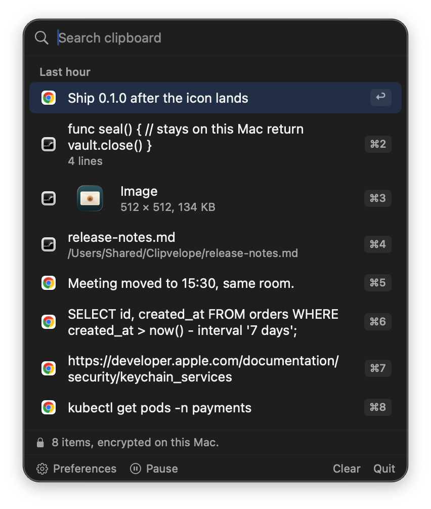
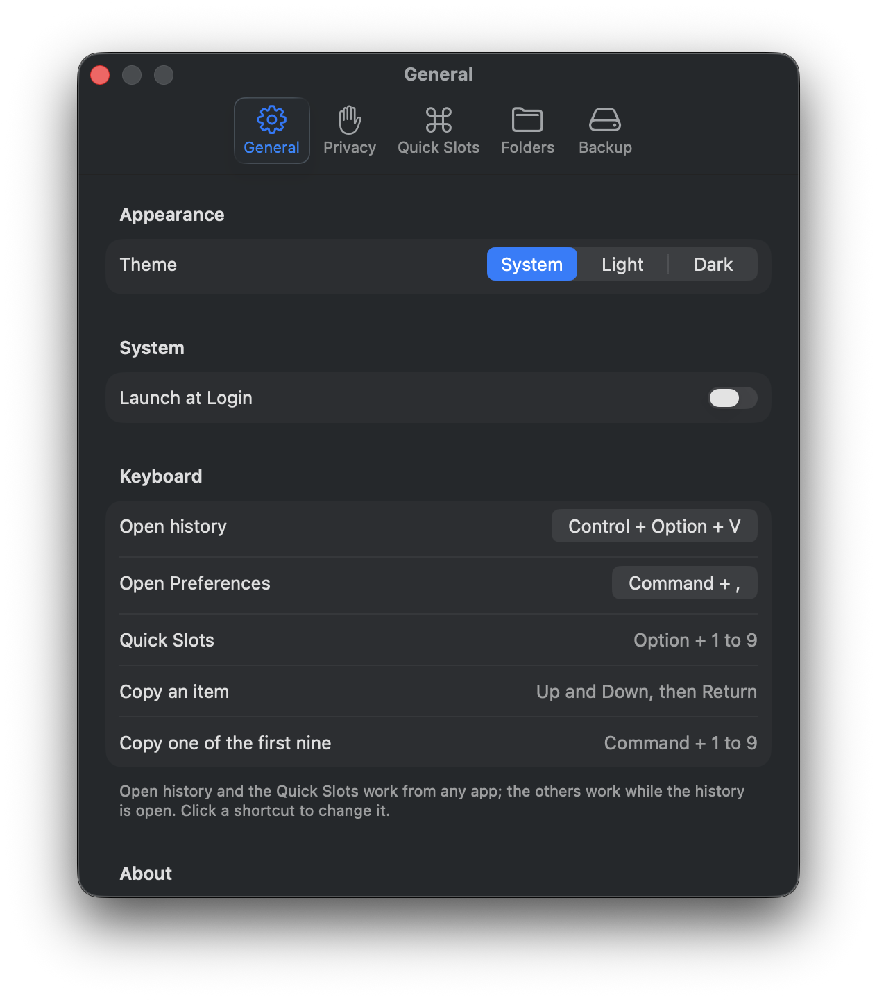

# Clipvelope

Local‑only macOS clipboard manager with encrypted storage.

<p align="center">
  
  &nbsp;&nbsp;
  
</p>

## Security / Privacy
- **Local only**: Clipvelope sends your clipboard nowhere. No telemetry, no account, no sync.
  The one thing that can put a copy outside this Mac is a feature you turn on yourself: auto backup
  writes to `~/Documents`, which iCloud copies to your account if you use Desktop & Documents sync.
  That file is encrypted and its key stays in the local Keychain, so what would sync is ciphertext.
  A release build contacts exactly one URL — the update feed, once a day, to ask whether a newer
  version exists — and sends nothing about you or what you copied. A build without the updater
  (`make app`, and what CI produces) makes no network calls at all, not even from `--status`.
  `Clipvelope --status` says which build you are running and, in a release build, whether
  that feed is actually reachable.
- **Encryption at rest**: everything is stored under `~/Library/Application Support/Clipvelope/` encrypted with **AES‑GCM** — the index and each image payload separately.
- **Key storage**: the encryption key is stored in the macOS **Keychain** under service `com.mujieha.Clipvelope`.
  A signed build puts it in the *data protection* keychain, where it is private to Clipvelope. An **ad-hoc build
  cannot** — the key then sits in the file keychain, readable by any app running as you. `Clipvelope --status`
  says which is in use; [docs/SIGNING.md](docs/SIGNING.md) explains why and how to fix it.
- **Fail‑safe**: if the vault cannot be decrypted (locked Keychain, denied access, corruption), Clipvelope **stops writing** and tells you, rather than silently starting from empty and overwriting your history.
- **Skips passwords by default**: content marked concealed by password managers (the `org.nspasteboard.*` convention) is not recorded. You can also ignore specific apps, or pause capture entirely.

## Install
1. Download `Clipvelope-<version>.dmg` from the [latest release](https://github.com/mujieha/clipvelope/releases/latest).
2. Open it and drag Clipvelope to Applications.
3. Launch it. It appears in the menu bar, not the Dock. Press **Control + Option + V**
   or click the icon.

Releases are signed with a Developer ID and notarized by Apple, so macOS opens
them without a warning. Updates arrive through the app itself.

## Requirements
- macOS 26 (Tahoe)
- Xcode 26+, only to build from source

## Build & Run (Xcode)
1. Clone the repo:
   ```bash
   git clone git@github.com:mujieha/clipvelope.git
   cd clipvelope
   ```
2. Open in Xcode:
   - File → Open… → select the `Clipvelope` folder (contains `Package.swift`)
3. Run the app (⌘R)

The app appears in the menu bar as **Clipvelope**.

## Usage
- Copy text anywhere → it's saved locally (encrypted).
- **Control + Option + V** opens the history from any app. Clicking the menu bar icon does the same.
  Change the shortcut in Preferences → General.
- Start typing to filter. **Tab** accepts the inline autocomplete suggestion.
- **↑ ↓** move the selection, **↩** copies it to the clipboard and closes the panel.
  **⌘1..9** copies the first nine directly; clicking an item does the same.
- **Esc** clears the search, or closes the panel if the search is already empty.
- **Option+1..9** triggers Quick Slots **system-wide** — from any app, no Accessibility permission needed.
- The list is grouped by when things were copied: Pinned, Last hour, Today, Yesterday, This week, Older.
  Each entry shows the icon of the app it was copied from.
- Hover an item to **pin** it (pinned items sort first and are never evicted by the history cap) or **delete** it.
- Re-copying something already in history moves it back to the top instead of duplicating it.
- The line above the buttons says what the vault is doing: how many items it holds, or that
  capture is paused, passwords are being recorded, or saving has stopped.
- "Clear" asks for confirmation, then deletes the encrypted vault and any auto-backup file.
- `Clipvelope --open` opens the history and `Clipvelope --preferences` opens Preferences, from a
  script or a launcher such as Raycast, Alfred or Karabiner, without needing Accessibility access.
  A request has to carry a token the running app keeps in its Keychain item, so merely posting the
  notification does nothing. That is convenience hardening, not a security boundary: anything running
  as you can run Clipvelope's own binary. See [SECURITY.md](SECURITY.md).
  **Command + ,** opens Preferences while the history is open; that one is changeable too.

## Preferences
Opened from the **Preferences** button in the menu.
- **General** — theme (System / Light / Dark), Launch at Login, the keyboard shortcuts (click one to
  change it), and the version.
- **Quick Slots** — the ⌥1–9 entries; each is a text snippet or a shell command whose output is copied.
- **Folders** — groups of snippets/commands with a Run button.
- **Privacy** — pause capture, skip concealed content, and the ignored-apps list.
- **Backup** — export/import, and auto-backup.

## Privacy controls
- **Pause** — from the menu footer or the Privacy tab. Nothing new is recorded while paused; existing history is kept.
- **Capture passwords and other sensitive content** (**off** by default) — password managers mark copied
  credentials, one-time codes and API tokens with `org.nspasteboard.ConcealedType` so apps like this one
  leave them alone; `TransientType` and `AutoGeneratedType` are skipped too.

  If you *want* those kept in your history, switch this on in **Preferences → Privacy**. It is deliberately
  awkward: it asks for confirmation first, and while it is on the menu shows a **"Recording passwords"**
  banner and the Privacy tab shows a warning, so it can never be on without you knowing. Importing a
  portable backup can never switch it on for you.

  What you are agreeing to: passwords you copy get written to your clipboard history. The history is
  encrypted on disk, but anything in it can be copied back out, and it is included in any backup you
  export.
- **Ignored apps** — anything copied while one of these apps is frontmost is not recorded.

## Backup & Restore
All in **Preferences → Backup**.
- **This Mac** — Export… / Import…: encrypted with your device Keychain key. This file can only be
  read back **on this Mac** — the key never leaves the local Keychain.
- **Portable** — Export… / Import… with a password you choose, stretched with
  **PBKDF2‑HMAC‑SHA256** (600,000 iterations, random 16‑byte salt). Restorable on any Mac.
  Because a portable backup can come from anyone, importing one **disables the Shell flag** on every
  Quick Slot and folder command it contains, and can never weaken your privacy settings, change your
  auto-backup choice, rebind your shortcuts, or add file references. The text is
  kept so you can read it and re-enable Shell yourself for anything you recognise. A keychain backup
  can only have been written by this Mac, so it restores unchanged.
- **Auto backup** (off unless you turn it on): writes `~/Documents/Clipvelope/clipvelope-backup.cvb`
  on every change, protected by either the Keychain key or your backup password. Note that
  `~/Documents` is one of the folders iCloud syncs when Desktop & Documents sync is on, so this is
  the one setting that can copy your (encrypted) history off this Mac. In Password mode nothing is written until a
  password has been saved; the Backup tab says so rather than silently writing a device-bound file.
- Every import asks for confirmation first, because it replaces the whole vault, pinned items included.

Backup files start with a `CVB1` header recording the mode and key‑derivation parameters, so the
format can change without stranding old files. Backups written by earlier versions still import.

## Uninstall
Clipvelope keeps its data in four places. Quit the app first (menu → Quit), then:

```bash
rm -rf ~/Library/Application\ Support/Clipvelope      # the encrypted vault
rm -rf ~/Documents/Clipvelope                         # auto-backups, if you enabled them
security delete-generic-password -s com.mujieha.Clipvelope -a clipboard-key
security delete-generic-password -s com.mujieha.Clipvelope -a auto-backup-password  # only if set
defaults delete com.mujieha.Clipvelope                # window and update-check state
```

Then drag the app to the Trash. If Launch at Login was on, macOS removes the entry
from System Settings → General → Login Items when the app is gone. A signed build
keeps its key in the data protection keychain, which `security` cannot see; there,
use Preferences → Privacy or Clear in the menu before deleting the app.

## Storage layout
```
~/Library/Application Support/Clipvelope/
  index.cvi          encrypted settings and item metadata (text lives here)
  items/<uuid>.cvi   one encrypted payload per image or formatted-text entry
```
Text stays in the index because it is small and search needs it in memory.
Image bytes do not, so copying one thing never rewrites the others — a copy
costs what the copied item costs, not what the whole history costs. A vault
from an earlier version (`clipboard.db`) is migrated on first launch; the
original is moved aside, not deleted.

## Notes
- Captures text, **formatted text**, images, and files. Files are stored as references, so they follow the original on disk.
- Formatted text (RTF or HTML) keeps its formatting: copying styled text and pasting it back into a rich editor
  preserves it, while pasting into a plain field still gives sensible text. Anything over 8 MB is kept as plain text.
- Each entry remembers **which app it was copied from** and shows that app's icon in the list.
- History is capped to the most recent 200 items and 512 MB of image payloads; pinned items are exempt from both.
- Images larger than 32 MB and plain text larger than 2 MB are skipped rather than stored.
- This app intentionally does **not** sync or upload anything.

## Development
```bash
make build    # swift build
make test     # runs the test suite (points DEVELOPER_DIR at Xcode for XCTest)
make app      # assembles dist/Clipvelope.app
make run      # build the bundle and launch it
make icon     # regenerates the menu bar template and the social preview
make smoke    # launches the built app and checks the panel and Preferences open
```

The app icon is an Icon Composer document, `Resources/Clipvelope.icon`: a sealed
envelope with a padlock stamped in its copper seal, as vector layers. `make app`
compiles it with Apple's `actool` into the layered `Assets.car` that macOS 26
draws with Liquid Glass, and renders the classic `.icns` from the system's own
drawing of it at every size. Open the document in Icon Composer to change it.
The menu bar icon is the same envelope as an 18-point vector template,
`Resources/MenuBarIcon.pdf`, regenerated by `make icon`.

`swift build` alone produces a bare executable, which cannot be a menu-bar app:
`LSUIElement` and Launch at Login both require a real bundle. Use `make app`.

`make test` points `DEVELOPER_DIR` at Xcode for that one command, because XCTest
ships inside Xcode and not the Command Line Tools. It does not change
`xcode-select` globally.

`Clipvelope --status` prints where the app is installed, its bundle identifier,
whether it is registered to launch at login, and where its vault lives.
`Clipvelope --open` tells a running instance to show the history; `--preferences` opens Preferences.

Builds are signed **ad-hoc** by default, which is fine for running the app on
the machine that built it. You need a real identity to share it with anyone
else — see [docs/SIGNING.md](docs/SIGNING.md), which also covers what ad-hoc
does and does not actually cost.

To ship it to other people — a signed, notarized DMG that opens without warnings
and updates itself — see [docs/DISTRIBUTION.md](docs/DISTRIBUTION.md).


## Support and security
Questions and bugs: [GitHub Issues](https://github.com/mujieha/clipvelope/issues).
Vulnerabilities: see [SECURITY.md](SECURITY.md); please report privately.
Contributions: see [CONTRIBUTING.md](CONTRIBUTING.md).

## Acknowledgements
Release builds embed [Sparkle](https://sparkle-project.org) for updates, under the
MIT license; its notice is in [docs/THIRD-PARTY-LICENSES.md](docs/THIRD-PARTY-LICENSES.md)
and inside the app under Preferences → General → Acknowledgements.

## License
MIT. See [LICENSE](LICENSE).
